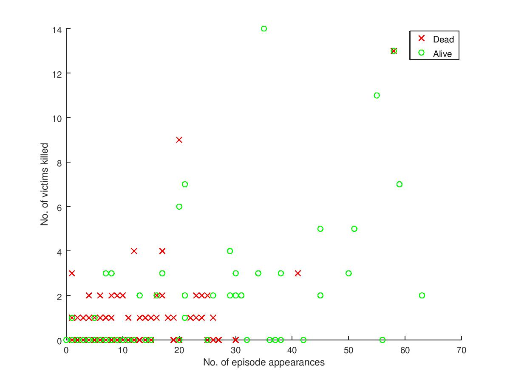

# Inputs Needed
1. A huge file with contents of the form:

|   Name (String)   |   No. of episode appearances (Number) |   Kill Count (Number) |   Dead (Y/N)  |
|:-----------------:|:-------------------------------------:|:---------------------:|:-------------:|

# Dataset (Raw)
   [The Ultimate Game of Thrones Dataset](https://medium.com/@jeffrey.lancaster/the-ultimate-game-of-thrones-dataset-a100c0cf35fb) links to 2 potential datasets:
    
    1. https://github.com/jeffreylancaster/game-of-thrones/blob/master/data/episodes.json
    2. https://github.com/jeffreylancaster/game-of-thrones/blob/master/data/characters.json

that can provide the information I'm aiming to use for this project.

# Procedure
1. From data/characters.json, for each character, obtain count of characters killed by them

    i.e. Loop through each object, obtain size of 'killed' array

2. From data/characters.json, for each character, obtain info. of *death* - look for presence of 'killedBy' array

    i.e. Loop through each object, obtain the size of 'killedBy' array

3. From data/episodes.json, for eac character, obtain count of no. of episodes(irrespective of seasons)

    i.e. Loop through each entry in top-level object "episodes", pick unique elements across multiple "characters" arrays (or) if a character is present, update a datastructure - "episodeCount" by 1 per appearance

# Challenges
1. The available 2 dataseets are in JSON format
    - Use Python to iterate through JSON and output CSV files

# Timeline

|   Task    |   Expected    |   Actual  |
|:----------|:-------------:|---------:|
|   1. Download 2 JOSN files    |   0.5 hrs |   0.5 hrs |
|   2. Write Python script to iterate (inital test)    |   1 hr |   - |
|   3. Make the script fully powered (final implementation)    |   1 hr |   1 hr |
|       |   - hrs |   3.1. Write to CSV: 0.75 hrs |
|       |   - hrs |   3.2. Incomplete data rows across datasets; need merging 0.5 hrs |
|       |   - hrs |   3.3. Introduce buildconfig and documentation 0.5 hrs |
|   4. Construct logistic regression model in Octave    |   2 hrs |   2 hrs |
|       |   0.5 hrs |   0.5 hrs |
|   5. Get build process, setup documentation and design documentation right   |   1 hr |   1 hr |